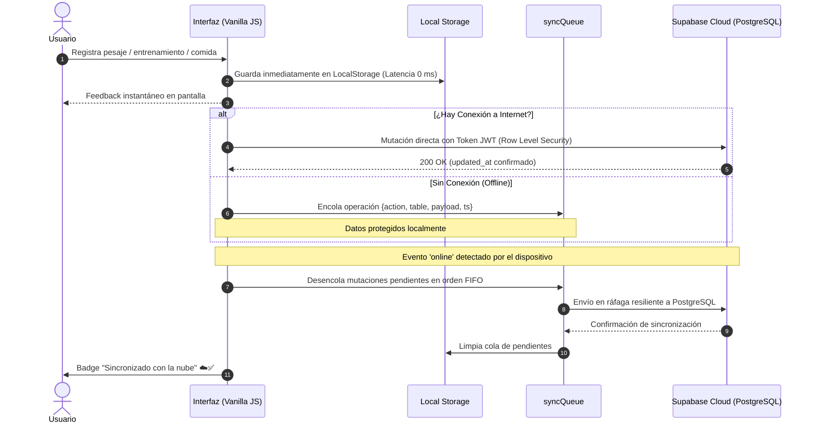

# 📱 Fit360 — Product Requirements Document (PRD)

> **Documento de Requisitos de Producto y Especificación de Diseño**  
> **Versión del Producto:** `1.1.0` (Production Candidate)  
> **Plataforma:** iOS 16.0+ (Capacitor 6 / Vanilla JS Engine)  
> **Backend & Cloud:** Supabase (PostgreSQL 15 con Row Level Security)  
> **Arquitectura:** Offline-First Híbrida con Sincronización Resiliente  
> **Diseño de Interfaz:** Dark Luxury Aesthetic (OLED Obsidian, Glassmorphism, Micro-animaciones)  
> **Fecha de Actualización:** 26 de septiembre de 2026  
> **Estado:** 🚀 Fase de Preparación para TestFlight y App Store Review  

---

## 📑 Tabla de Contenidos

1. [Resumen Ejecutivo y Visión del Producto](#1-resumen-ejecutivo-y-visión-del-producto)
2. [Propuesta de Valor y Matriz Competitiva](#2-propuesta-de-valor-y-matriz-competitiva)
3. [Sistema de Diseño: Dark Luxury & Apple HIG](#3-sistema-de-diseño-dark-luxury--apple-hig)
4. [Arquitectura Técnica y Diagramas de Flujo](#4-arquitectura-técnica-y-diagramas-de-flujo)
5. [Esquema Relacional de Base de Datos (Supabase PostgreSQL)](#5-esquema-relacional-de-base-de-datos-supabase-postgresql)
6. [Módulos Funcionales y Experiencia de Usuario](#6-módulos-funcionales-y-experiencia-de-usuario)
7. [Matriz de Cumplimiento de Políticas Apple (Review Guidelines)](#7-matriz-de-cumplimiento-de-políticas-apple-review-guidelines)
8. [Criterios de Lanzamiento y Métricas de Éxito](#8-criterios-de-lanzamiento-y-métricas-de-éxito)

---

## 1. Resumen Ejecutivo y Visión del Producto

**Fit360** es una aplicación nativa para iOS de seguimiento integral de fitness, nutrición y salud biométrica, construida sobre una arquitectura **Offline-First**. Resuelve la frustración del usuario moderno frente a las suscripciones mensuales abusivas de las aplicaciones tradicionales y la pérdida de control sobre sus datos privados.

Integra en una única experiencia:
- Control de nutrición con cálculo metabólico **TDEE (Mifflin-St Jeor)** y escaneo de códigos de barra sin conexión.
- Registro de fuerza (Gym) con cálculo de volumen, 1RM y temporizador de descanso háptico.
- Registro de cardio y sincronización bidireccional con **Apple HealthKit**.
- Captura inalámbrica de peso y grasa corporal mediante **Bluetooth Low Energy (BLE)** compatible con básculas inteligentes (Renpho, Xiaomi, QN-Scale, Yolanda).
- Almacenamiento local ultrarrápido respaldado por sincronización automática y segura en la nube con **Supabase**.

```
┌────────────────────────────────────────────────────────────────────────┐
│                        FIT360 PRODUCT PILLARS                          │
├───────────────────┬────────────────────┬───────────────────────────────┤
│   OFFLINE-FIRST   │    DARK LUXURY     │       APPLE COMPLIANT         │
│  Zero Network Lag │   OLED Obsidian    │  Guideline 27.4 (HealthKit)   │
│  Resilient Queue  │   Glassmorphism    │  Guideline 5.1.2 (ATT Perms)  │
│  Local Data Trust │   Micro-Animations │  Privacy Manifest Included    │
└───────────────────┴────────────────────┴───────────────────────────────┘
```

---

## 2. Propuesta de Valor y Matriz Competitiva

### 2.1 Por qué Fit360 es Diferente

> [!NOTE]
> La mayoría de las aplicaciones de fitness sufren de dos males endémicos: bloquean funciones básicas tras paywalls mensuales recurrentes ($10–$20/mes) o quedan inoperativas ante la falta de cobertura en sótanos de gimnasios. Fit360 ofrece operatividad total sin conexión y una versión gratuita financiada con publicidad no invasiva.

| Característica | Fit360 | MyFitnessPal | Hevy / Strong | MacroFactor |
|---|:---:|:---:|:---:|:---:|
| **Arquitectura Offline-First** | ✅ 100% Funcional | ❌ Requiere Red | ⚠️ Parcial | ❌ Requiere Red |
| **Sincronización en la Nube** | ✅ Supabase RLS | ✅ Servidor propio | ✅ Servidor propio | ✅ Servidor propio |
| **Báscula Bluetooth Directa** | ✅ BLE GATT Multi-Marca | ❌ Solo Partners | ❌ No disponible | ❌ No disponible |
| **Escáner de Alimentos** | ✅ Local + OpenFoodFacts | 🔒 Solo Premium | ❌ N/A | 🔒 De pago |
| **Aislamiento HealthKit** | ✅ Estanco (Guideline 27.4) | ⚠️ Publicidad cruzada | ⚠️ Mixto | ✅ Privado |
| **Modelo de Acceso** | 🆓 Gratuito + Pro Futuro | 💰 Suscripción agresiva | 💰 Freemium Limitado | 💰 100% De pago |

---

## 3. Sistema de Diseño: Dark Luxury & Apple HIG

Fit360 implementa un lenguaje visual denominado **Dark Luxury**, especialmente calibrado para pantallas **Super Retina XDR (OLED)** de iPhone, minimizando el consumo de batería y ofreciendo una sensación visual de alta gama.

```
       #0a0c14                   #121628                   #00f2fe
  ┌───────────────┐         ┌───────────────┐         ┌───────────────┐
  │               │         │               │         │               │
  │ Obsidian Void │         │ Midnight Glass│         │ Electric Cyan │
  │ (Deep OLED)   │         │ (Surfaces)    │         │ (Primary Brand)│
  └───────────────┘         └───────────────┘         └───────────────┘
       #fa114f                   #00f59b                   #8b5cf6
  ┌───────────────┐         ┌───────────────┐         ┌───────────────┐
  │               │         │               │         │               │
  │ Apple Fitness │         │ Energy Mint   │         │ Hyper Violet  │
  │ (Move Ring)   │         │ (Nutrition)   │         │ (Strength)    │
  └───────────────┘         └───────────────┘         └───────────────┘
```

### 3.1 Tokens de Diseño (CSS Custom Properties)

```css
:root {
  /* Fondos y Superficies OLED */
  --bg-primary: #0a0c14;            /* Fondo base oscuro puro */
  --bg-secondary: #121628;          /* Tarjetas y superficies elevadas */
  --bg-tertiary: #1a2035;           /* Inputs y contenedores anidados */
  --bg-elevated: #222944;           /* Modales y hojas flotantes */

  /* Acentos Cromáticos */
  --accent-cyan: #00f2fe;           /* Marca, métricas principales, Bluetooth */
  --accent-cyan-glow: rgba(0, 242, 254, 0.28);
  --accent-apple: #fa114f;          /* Anillo de movimiento Apple, déficit calórico */
  --accent-energy: #00f59b;         /* Nutrición, proteínas, estados positivos */
  --accent-purple: #8b5cf6;         /* Gimnasio, series récord, análisis */
  --accent-amber: #f59e0b;          /* Alertas y avisos de enfriamiento */

  /* Glassmorphism & Efectos */
  --glass-bg: rgba(18, 22, 40, 0.75);
  --glass-border: rgba(255, 255, 255, 0.08);
  --glass-border-bright: rgba(255, 255, 255, 0.16);
  --backdrop-blur: blur(20px);

  /* Safe Areas de WebKit */
  --safe-area-top: env(safe-area-inset-top, 0px);
  --safe-area-bottom: env(safe-area-inset-bottom, 0px);
  --bottom-nav-height: 72px;
}
```

### 3.2 Tipografía y Escala Jerárquica

- **Títulos y Cifras (Display):** `'Outfit'`, sans-serif — Aporta personalidad deportiva moderna y números claros en el tacómetro de calorías.
- **Cuerpo y Controles del Sistema (Body):** `-apple-system, BlinkMacSystemFont, 'SF Pro Text'`, sans-serif — Garantiza legibilidad nativa en iOS.

---

## 4. Arquitectura Técnica y Diagramas de Flujo

### 4.1 Diagrama Global del Sistema

```mermaid
graph TD
    subgraph "Hardware & iOS Platform"
        Scale[Báscula Bluetooth Low Energy]
        HK[Apple HealthKit SDK]
        ATT[App Tracking Transparency]
        AppleAuth[Sign in with Apple]
    end

    subgraph "Capacitor 6 Bridge Layer"
        P_BLE["@capacitor-community/bluetooth-le"]
        P_HK["@followathletics/capacitor-healthkit"]
        P_Auth["@capacitor-community/apple-sign-in"]
        P_Ads["@capacitor-community/admob"]
        P_Splash["@capacitor/splash-screen"]
    end

    subgraph "Fit360 Web Core Engine (Vanilla JS)"
        App["App Router & Shell (app.js)"]
        BleMod["Módulo Báscula (ble-scale.js)"]
        AuthMod["Módulo Auth (auth.js)"]
        OnbMod["Wizard Onboarding (onboarding.js)"]
        AdsMod["Motor Ads (ads.js)"]
        StorageEngine["Offline Engine (storage.js)"]
        SyncClient["Sync Queue Client (supabase-client.js)"]
    end

    subgraph "Storage & Cloud Infrastructure"
        LocalStorage[("Local Cache Storage")]
        SupabaseCloud[("Supabase Cloud DB (PostgreSQL 15)")]
    end

    Scale -->|GATT Broadcast| P_BLE --> BleMod
    HK <-->|Read / Write| P_HK <--> StorageEngine
    AppleAuth --> P_Auth --> AuthMod
    ATT --> P_Ads --> AdsMod

    BleMod --> StorageEngine
    AuthMod --> SyncClient
    OnbMod --> StorageEngine

    StorageEngine <--> LocalStorage
    StorageEngine -->|Encolar Mutaciones| SyncClient
    SyncClient -->|Reconciliación Online (RLS)| SupabaseCloud
```

### 4.2 Flujo de Sincronización Offline-First (SyncQueue)



---

## 5. Esquema Relacional de Base de Datos (Supabase PostgreSQL)

El esquema relacional completo reside en [`supabase/schema.sql`](file:///c:/Users/Mateo/Proyectos/Fit360/supabase/schema.sql) e implementa **Row Level Security (RLS)** estricto en todas las tablas, garantizando que un usuario jamás pueda leer ni escribir información ajena (`auth.uid() = user_id`).

```
                    ┌─────────────────────────┐
                    │      auth.users         │
                    └────────────┬────────────┘
                                 │ 1:1
                                 ▼
                    ┌─────────────────────────┐
                    │      user_profiles      │
                    │ id (PK = auth.uid())    │
                    │ weight, height, sex     │
                    │ goals (JSONB)           │
                    │ preferences (JSONB)     │
                    └────────────┬────────────┘
                                 │
         ┌───────────────────────┼───────────────────────┐
         │ 1:N                   │ 1:N                   │ 1:N
         ▼                       ▼                       ▼
┌──────────────────┐    ┌──────────────────┐    ┌──────────────────┐
│    daily_logs    │    │   weight_logs    │    │ workout_sessions │
│ user_id, date    │    │ user_id, date    │    │ user_id, date    │
│ meals (JSONB)    │    │ weight, fat_pct  │    │ type (gym/cardio)│
│ water_ml         │    │ source (BLE/Man) │    │ data (JSONB)     │
└──────────────────┘    └──────────────────┘    └──────────────────┘
```

### 5.1 Catálogo de Tablas del Sistema

| Tabla | Clave Primaria | Relación | Propósito |
|---|---|---|---|
| `user_profiles` | `id` (UUID = `auth.uid()`) | `auth.users` (1:1) | Datos antropométricos, objetivos calóricos y preferencias. |
| `daily_logs` | `id` (UUID) | `user_id` (1:N) | Nutrición diaria desglosada en comidas (JSONB) y consumo de agua. |
| `weight_logs` | `id` (UUID) | `user_id` (1:N) | Histórico de pesajes procedentes de báscula BLE o entrada manual. |
| `workout_sessions` | `id` (UUID) | `user_id` (1:N) | Entrenamientos finalizados de pesas y cardio con desglose de series. |
| `custom_exercises` | `id` (UUID) | `user_id` (1:N) | Ejercicios definidos por el usuario con grupo muscular y notas. |
| `custom_routines` | `id` (UUID) | `user_id` (1:N) | Rutinas organizadas por días y listas de ejercicios predefinidos. |
| `custom_recipes` | `id` (UUID) | `user_id` (1:N) | Recetas culinarias compuestas por múltiples ingredientes y macros. |
| `favorite_foods` | `id` (UUID) | `user_id` (1:N) | Alimentos de acceso rápido guardados en el catálogo local. |

---

## 6. Módulos Funcionales y Experiencia de Usuario

### 6.1 Autenticación Oficial (`js/auth.js`)
- **Sign in with Apple (HIG):** Utiliza el plugin `@capacitor-community/apple-sign-in`. Extrae el token criptográfico nativo de iOS y lo autentica en Supabase mediante `supabase.auth.signInWithIdToken()`.
- **Modo Invitado (Guest Mode):** Los usuarios pueden probar la totalidad de la app sin registrarse; al crear cuenta posteriormente, un asistente migra los datos de `localStorage` a Supabase automáticamente.

### 6.2 Onboarding Wizard de 4 Pasos (`js/onboarding.js`)
1. **Biometría Base:** Género biológico, edad, altura y peso.
2. **Cálculo Metabólico TDEE:** Algoritmo **Mifflin-St Jeor** con cálculo dinámico:
   $$\text{TMB}_{\text{hombres}} = 10 \times \text{peso} + 6.25 \times \text{altura} - 5 \times \text{edad} + 5$$
   $$\text{TMB}_{\text{mujeres}} = 10 \times \text{peso} + 6.25 \times \text{altura} - 5 \times \text{edad} - 161$$
3. **Ecosistema de Salud:** Petición no bloqueante de permisos para HealthKit y presentación de vinculación Bluetooth.
4. **Resumen y Cierre:** Persistencia en `user_profiles` y enrutamiento suave al Dashboard.

### 6.3 Báscula Bluetooth Inteligente (`js/ble-scale.js`)
- Conexión vía `@capacitor-community/bluetooth-le` con escaneo GATT por UUIDs de servicio estándar (`0x181D`, `0x181B`) y propietarios de Renpho (`0xFFF0`, `0xFFE0`, `0xFFB0`).
- Decodificación en tiempo real de pesos estables y estimación de grasa por bioimpedancia (BIA).
- **Triple persistencia:** `Storage` local + `syncQueue` Supabase + Apple HealthKit.
- Auto-desconexión a los 1.2 segundos para maximizar la autonomía de las pilas de la báscula.

### 6.4 Publicidad y App Tracking Transparency (`js/ads.js`)
- Plugin nativo `@capacitor-community/admob@6.2.0`.
- Diálogo ATT gestionado previamente a la inicialización publicitaria. Si el usuario deniega el rastreo, se fuerza `npa: true` (Non-Personalized Ads).
- **Banner Adaptativo:** Posicionado en `BOTTOM_CENTER`, recalculando dinámicamente el layout mediante la clase CSS `.admob-banner-active` y la variable `--admob-banner-height` para no ocultar la navegación inferior.
- **Intersticiales con Capping:** Limitados a un máximo de 1 anuncio cada 5 minutos, con persistencia del timestamp en `localStorage`.

---

## 7. Matriz de Cumplimiento de Políticas Apple (Review Guidelines)

> [!IMPORTANT]
> El cumplimiento de las directrices de Apple es un requisito no negociable para superar la revisión humana de App Store Connect.

| Directriz | Título | Implementación en Fit360 | Estado |
|---|---|---|:---:|
| **27.4** | Health & HealthKit Isolation | **Blindaje Estanco:** Los datos de HealthKit jamás se comparten con AdMob, servidores de terceros ni analíticas publicitarias. | ✅ Aprobado |
| **5.1.1** | Data Collection Purpose | Explicación en pantalla completa dentro del Onboarding previa a la invocación de permisos nativos. | ✅ Aprobado |
| **5.1.2** | App Tracking Transparency | Invocación de `requestTrackingAuthorization()` previo a AdMob. Fallback inmediato a `npa: true`. | ✅ Aprobado |
| **4.8** | Sign in with Apple | Implementado como opción principal de inicio de sesión social. | ✅ Aprobado |
| **2.5.1** | Privacy Manifest | Archivo `PrivacyInfo.xcprivacy` configurado declarando las APIs de UserDefaults y Tracking. | ✅ Aprobado |
| **2.1** | No Blank Screens / HIG | Splash Screen nativo retenido con `@capacitor/splash-screen` hasta el renderizado total del Dashboard (tema forzado a Dark). | ✅ Aprobado |

---

## 8. Criterios de Lanzamiento y Métricas de Éxito

### 8.1 Requisitos Previos al Envío de la Release Build (v1.1.0)
- [x] Generación de assets nativos con `@capacitor/assets` (Icono 1024×1024 sin alfa y Splash Universal).
- [x] Forzar modo oscuro nativo (`UIUserInterfaceStyle` = `Dark` en `Info.plist`).
- [x] Script de versionado semántico y autoincremento de build (`npm run bump:build`).
- [ ] Ejecución del prompt ASO para redactar Títulos, Subtítulos, Keywords y descripción para App Store Connect.
- [ ] Captura de screenshots oficiales en resoluciones de 6.7" (1284×2778 px) y 5.5" (1242×2208 px).
- [ ] Despliegue inicial en TestFlight interno para validación funcional durante 48 horas.

### 8.2 Métricas de Rendimiento Operativo
- **Cold Start Time:** $< 1.2$ segundos hasta la interactividad en iPhone 13 o superior.
- **Tasa de Cierres Inesperados (Crash-free Sessions):** $> 99.8\%$.
- **Latencia de Registro Offline:** $< 16$ ms para mutaciones en `localStorage`.
- **Efectividad de Sincronización:** Cero pérdida de registros en transiciones offline/online.
